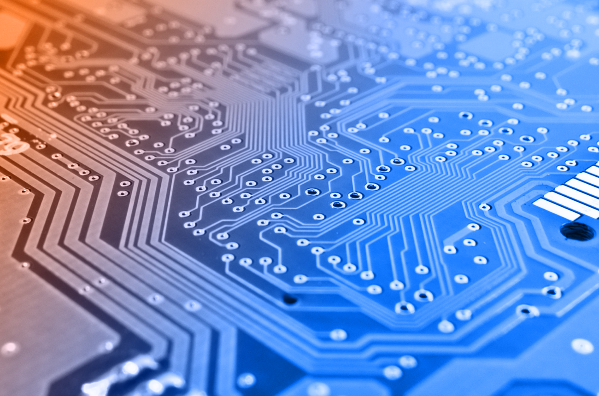

<p align='center'>
    
    </img>
</p>

<br/>

# Introduction to Digital Circuit
📡 Comprehensive Resource for digital circuit Concepts 🌐

This repository contains lab assignments and lecture slides for the Introduction to Digital Circuits course, offering essential resources for students and educators.


# Features:
- Lab Assignments: Hands-on exercises that reinforce key networking concepts and practical skills.
- Lecture Slides: Downloadable presentations covering essential topics in computer networking.
- Structured Organization: Easy navigation through materials organized by weeks and topics for efficient study.

Explore, learn, and deepen your knowledge of computer networks with these valuable resources!


<br/>
<br/>

## License

© [2024] [Nguyen Thanh Dang]. All rights reserved.

This repository and its contents, including but not limited to lab assignments, lecture slides, and any associated materials, are for educational purposes only. 

**No part of this repository may be copied, reproduced, or distributed without explicit permission from the copyright holder.**

For inquiries, please contact [```dangnguyen.uit@gmail.com```].